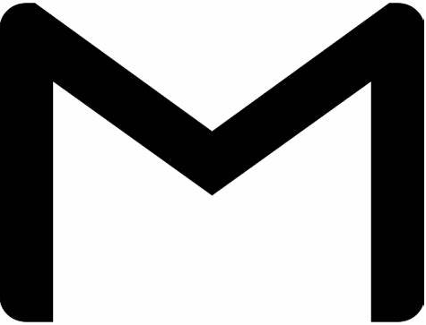
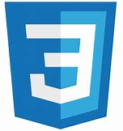

<h1> Olá! &#128515;</h1>

Oi! Sou Guilherme Saggion, Sou um estudante e amante de programação.💻

Sou novo por aqui, mas pretendo passar um tempo por aqui todo dia para conhecer melhor a plataforma e conhcer outros devs!&#128526 
    Pretendo também postar alguns dos trabalhos que estou fazendo para posteriormente poder notar meu progresso!🚀

<h3>📫 Entre em contato comigo!</h3>
<table cellpadding="10px">
    <tr>
        <th></th>
    </tr>
</table>

<h3>🔗 Conecte-se comigo!</h3>
<table cellpadding="10px">
    <tr>
        <th></th>            
        <th></th>
    </tr>
</table>

<h3>Lingugens e ferramentas</h3>
<table cellpadding="10px">
    <tr>
        <th></th>
        <th></th>
        <th></th>
    </tr>
</table>

